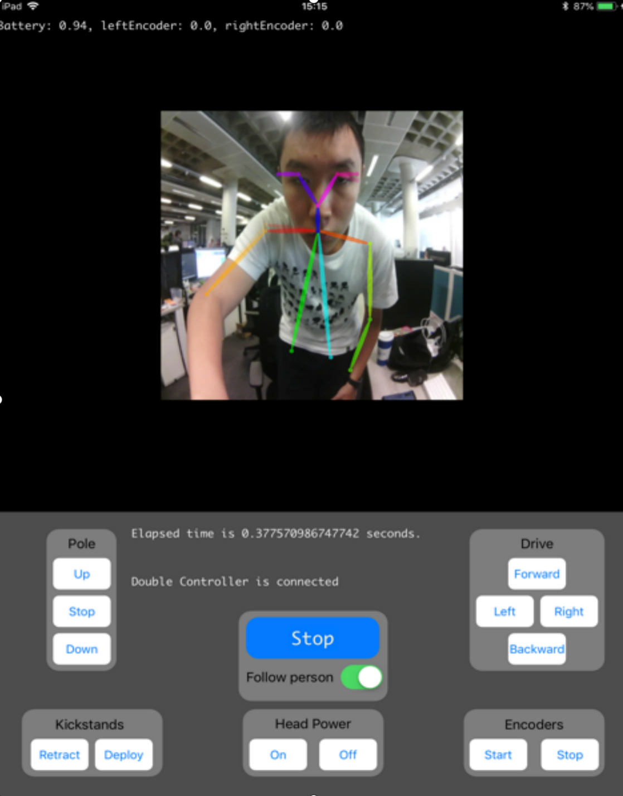
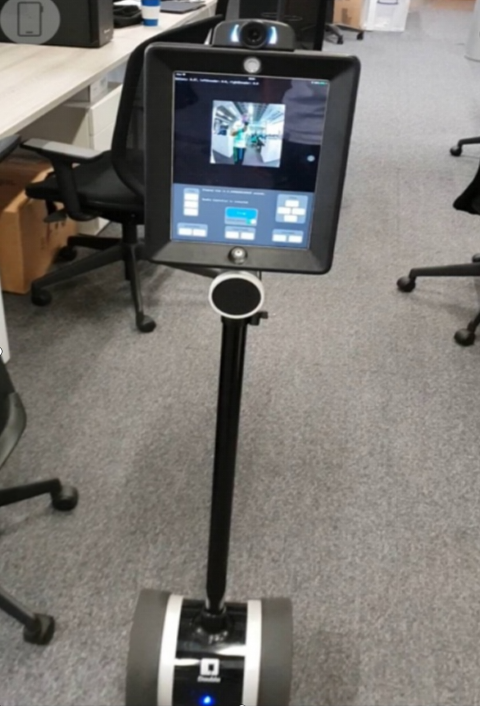
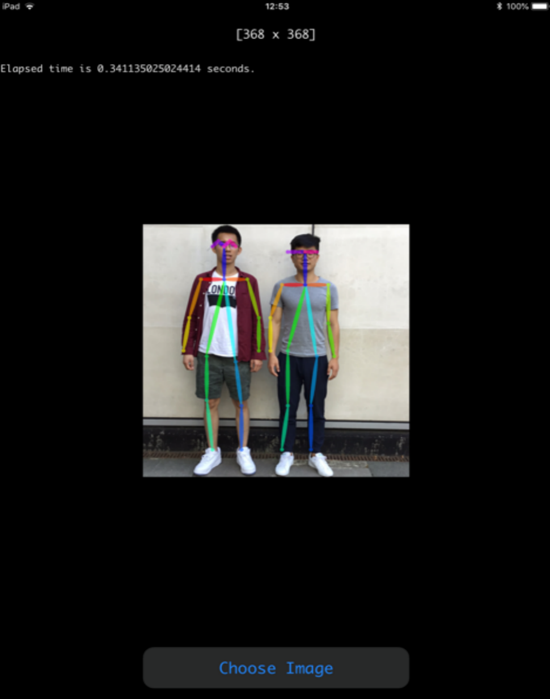
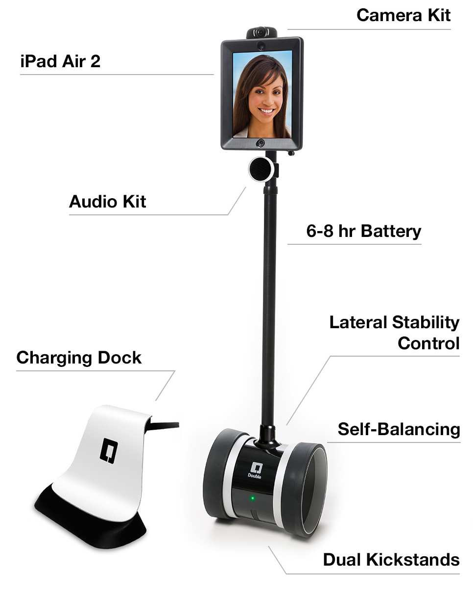

## Realtime-Openpose-on-iOS-with-Double-Robot

This project achieves run the Openpose model(human pose estimation) on iOS device in real-time, and also a mobile robot named Double Robot is controlled by iOS device at same time.

## Requirements
You can build this app on a iPad with your mac with XCode.

 

## Demo Picture

   

## References

Please consider citing the following works, if you use in your research/projects:

	@inproceedings{wang2021single,
	  title={A single RGB camera based gait analysis with a mobile tele-robot for healthcare},
	  author={Wang, Ziyang and Deligianni, Fani and Voiculescu, Irina and Yang, Guang-Zhong},
	  booktitle={2021 43rd Annual International Conference of the IEEE Engineering in Medicine \& Biology Society (EMBC)},
	  pages={6933--6936},
	  year={2021},
	  organization={IEEE}
	}

## Double Robot
The information about Double Robot can be found here:
https://www.doublerobotics.com/
